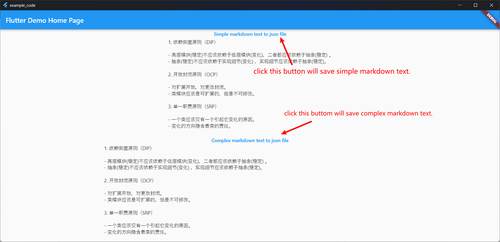
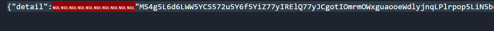

# example_code

Reproduction of bugs in [crimson](https://github.com/simc/crimson/issues/20#issue-1640863748).

When you save more complex markdown text, it will trigger the following bug:

At this point in time the editor will think it is a binary file, the above image is forced to show the appearance of the text.